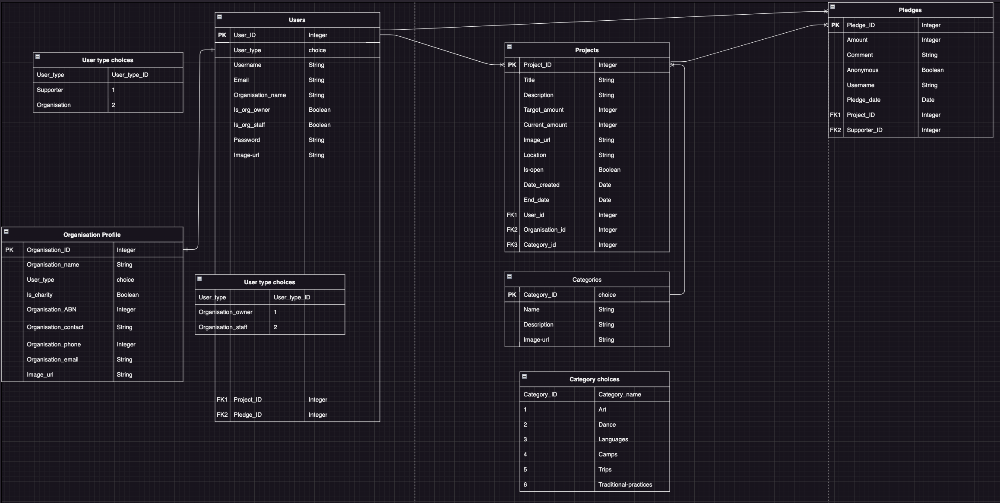
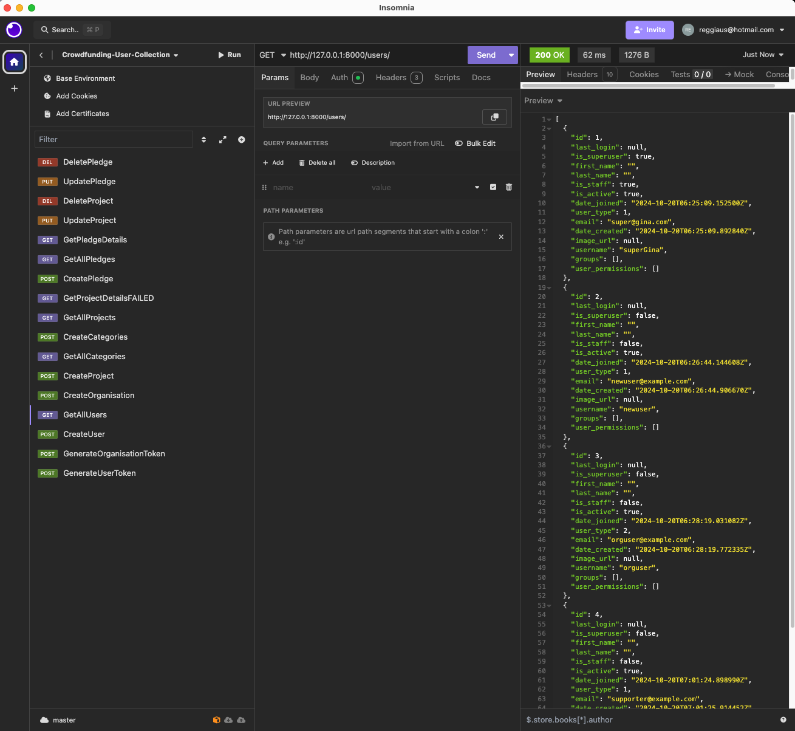
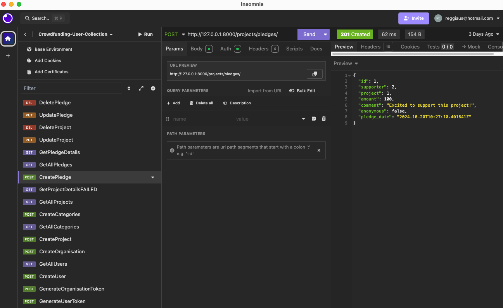
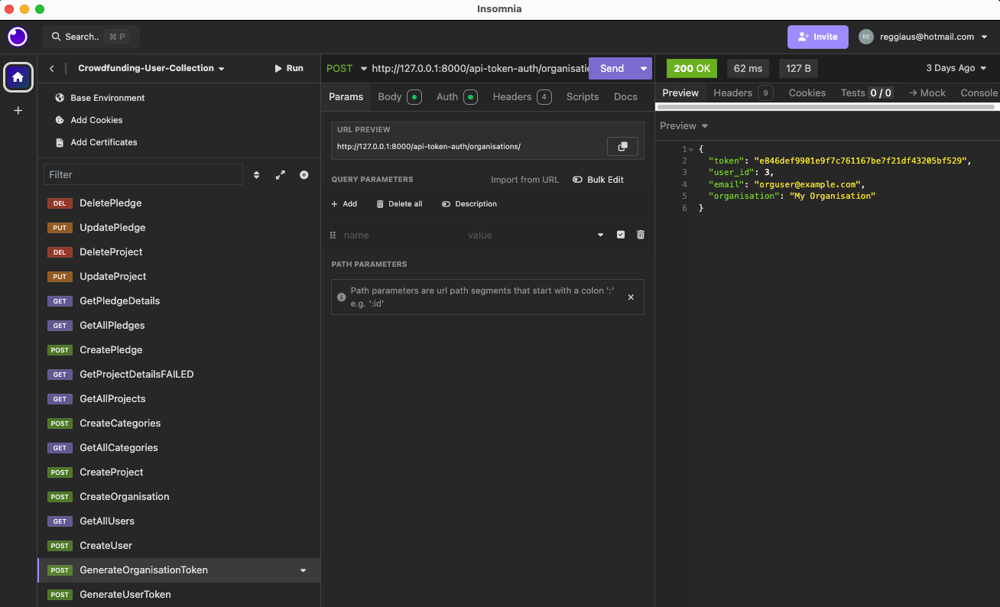

## Project Description
Kickstarter, Go Fund Me, Kiva, Change.org, Patreon… All of these different websites have something in common: they provide a platform for people to fund projects that they believe in, but they all have a slightly different approach. You are going to create your own crowdfunding website, and put your own spin on it!

## Project Requirements
Your crowdfunding project must:

- [ ] Be separated into two distinct projects: an API built using the Django Rest Framework and a website built using React. 
- [x] Have a cool name, bonus points if it includes a pun and/or missing vowels. See https://namelix.com/ for inspiration. <sup><sup>(Bonus Points are meaningless)</sup></sup>
- [x] Have a clear target audience.
- [x] Have user accounts. A user should have at least the following attributes:
  - [x] Username
  - [x] Email address
  - [x] Password
- [x] Ability to create a “project” to be crowdfunded which will include at least the following attributes:
  - [x] Title
  - [x] Owner (a user)
  - [x] Description
  - [x] Image - changes made to allow users in the frontend to upload their own images
  - [x] Target amount to fundraise
  - [x] Whether it is currently open to accepting new supporters or not
  - [x] When the project was created
- [x] Ability to “pledge” to a project. A pledge should include at least the following attributes:
  - [x] An amount
  - [x] The project the pledge is for
  - [x] The supporter/user (i.e. who created the pledge)
  - [x] Whether the pledge is anonymous or not
  - [x] A comment to go along with the pledge
- [X] Implement suitable update/delete functionality, e.g. should a project owner be allowed to update a project description?
- [X] Implement suitable permissions, e.g. who is allowed to delete a pledge?
- [X] Return the relevant status codes for both successful and unsuccessful requests to the API.
- [X] Handle failed requests gracefully (e.g. you should have a custom 404 page rather than the default error page).
- [X] Use Token Authentication, including an endpoint to obtain a token along with the current user's details.
- [ ] Implement responsive design.

## Additional Notes
No additional libraries or frameworks, other than what we use in class, are allowed unless approved by the Lead Mentor.

Note that while this is a crowdfunding website, actual money transactions are out of scope for this project.

## Submission
To submit, fill out [this Google form](https://forms.gle/34ymxgPhdT8YXDgF6), including a link to your Github repo. Your lead mentor will respond with any feedback they can offer, and you can approach the mentoring team if you would like help to make improvements based on this feedback!

Please include the following in your readme doc:
- [X] A link to the deployed project. https://culture4kids-7a814d1e1904.herokuapp.com/users/
- [X] A screenshot of Insomnia, demonstrating a successful GET method for any endpoint.
- [X] A screenshot of Insomnia, demonstrating a successful POST method for any endpoint.
- [X] A screenshot of Insomnia, demonstrating a token being returned.
- [X] Step by step instructions for how to register a new user and create a new project (i.e. endpoints and body data).
- [X] Your refined API specification and Database Schema.

# crowdfunding_back_end
Culture4Kids: Empowering Aboriginal and Torres Strait Islander kids

## Planning:
### Concept/Name
The crowdfunding platform Culture4Kids connects Aboriginal and Torres Strait Islander kids who have been taken into State care with their culture, country and community through supporting grassroots cultural programs like dance, art, traditional practices, language classes, cultural camps, on country trips, boys cultural pathways, or girls cultural pathways. Aboriginal led organisations who are looking to crowdfund existing cultural programs or would like to add new cultural programs, can add/create the cultural program as a project to raise funds. There will be an indication if the organisation is a registered charity with the option to receive tax invoices for donations of more than $2AUD.

### Intended Audience/User Stories
Who are your intended audience (creating projects)? 
- Aboriginal and/or Torres Strait Islander Community Controlled Organisations (ACCOs)
- Aboriginal and/or Torres Strait Islander Corporations
- Aboriginal and/or Torres Strait Islander Community Centres
- Aboriginal and/or Torres Strait Islander language centres

Who are your intended audience (supporters/pledges)
- Anyone with spare money who is an Ally for First Nations children and happy to support their connection to culture.

**User stories:**
1. User registration
   As a new user, I want to create an account so that I can log in and participate in projects.
2. User login
   As a registered user, I want to login so that I can access my account and depending on my permissions, I can support projects or create projects.
3. Select role - User or Organisation
   As a registered user, I can make pledges. If I fulfil the requirements of an organisation (ABN), I can create projects for children in care. I will need an ABN and indicate if my organisation is a registered charity.
4. Create a Project
   As a registered user with the role of organisation, I can create a new crowdfunding project so that I can raise funds for programs that support Aboriginal children in care. 
5. Pledge to a Project
   As a supporter, I want to pledge money to a project so that I can help fund a project I believe in.
6. View all projects
   As a visitor, I want to see all available projects, so that I can browse and decide which one to support. Once I found a project that aligns with my interests I can see details but I will be prompted to login or signup.
7. View project details
   As a supporter, I want to view the specific details of a project so that I can understand the project's goals and track its progress.
8. Update project details
   As an organisation I want to update the details of my project, so that I can keep potential supporters informed of any changes.
9. Delete a project
   As an organisation I want to delete my project so that I can remove it if it is no longer needed or relevant.
10. Anonymous pledging
    As a supporter, I want to pledge anonymously so that I can support a project without revealing my identity.
11. View categories
    As a visitor, I want to browse categories so that I can find projects that align with my interests. 
  
### Step-by-Step instructions for how to register a new user and create a new project:
**Register a New User**
1. **Endpoint:** POST /users/
2. **Description:** This endpoint allows users to register an account.
3. **Body Data** (in JSON):
   `{
  "username": "example_user",
  "email": "example@example.com",
  "password": "securepassword123"
   }`
  Select your role - user or organisation
  **Body Data for organisations** (in JSON):
   `{
  "organisation_name": "Awesome Organisation",
  "contact_name": "John Doe",
  "phone_number": "123456789",
  "email": "contact@awesome.org",
  "abn": "1234567890",
  "charity_status": true,
  "image_url": "https://example.com/logo.png"
    }`
   
4. **Response:** Upon successful registration, you will receive a response with the created user details, excluding the password, and status code `201 Created`. It looks like:
   `{
  "id": 1,
  "username": "example_user",
  "email": "example@example.com"
   }`

**Log in to generate user token**
1. **Endpoint:** POST /api-token-auth/users/
2. **Description:** This endpoint generates a token for the user to authenticate further requests.
3. **Body data** (in JSON):
   `{
  "username": "example_user",
  "password": "securepassword123"
   }`
4. **Response:** You'll receive a token like this:
   `{
  "token": "your-authentication-token"
    }`

**Create a New Project (Only as organisation)**
1. **Endpoint:** POST /projects/
2. **Description:** After creating an organisation you can create projects as an organisation.
3. **Authorisation:** Token <your-organisation-token-here>
4. **Body Data** (in JSON):
   `{
   "title": "New Project",
   "description": "This is an exciting new project!",
   "target_amount": 5000,
   "current_amount": 0,
   "image_url": "https://example.com/project.png",
   "location": "Sydney",
   "end_date": "2024-12-31T23:59:59Z",
   "category": 1,
   "organisation": 1
   }`
5. **Response:** On success, returns the project details with status code `201 Created`.

### Front End Pages/Functionality
- {{ A page on the front end }}
    - {{ A list of dot-points showing functionality is available on this page }}
    - {{ etc }}
    - {{ etc }}
- {{ A second page available on the front end }}
    - {{ Another list of dot-points showing functionality }}
    - {{ etc }}

### API Spec

| URL | HTTP Method | Purpose | Request Body | Success Response Code | Authentication/Authorisation |
| --- | --- | --- | --- | --- | --- |
| /projects/ | GET | Returns all projects. | N/A | 200 | N/A |
| /projects/ | POST | Create new project. | Project object | 201 | Must be logged in as organisation. |
| /projects/{id}/ | GET | Retrieve project details by ID | N/A | 200 | Must be logged in. |
| /projects/{id}/ | PUT | Update an existing project. | Project object | 201 | Must be logged in as project owner. |
| /projects/{id}/ | DELETE | Delete a project. | Project object | 201 | Must be logged in as project owner. |
| /users/ | GET | Returns all users. | N/A | 200 | Must be superuser. |
| /users/ | POST | Register a new user. | user object |201 | N/A |
| /api-token-auth/users/ | POST | Generate a user token for authentication | user object | 200 | Must be logged in. |

### DB Schema
[Link to ERD](https://github.com/GinaHorch/crowdfunding_back_end/blob/88fc84e325916dae8a9e69909d6532e032fd7e45/crowdfunding/erd.png)
### A screenshot of the ERD




### **Users Table**
| Field Name   | Data Type   | Constraints         | Description              |
|--------------|-------------|---------------------|--------------------------|
| `id`         | `AutoField` | Primary Key          | Unique ID for each user  |
| `username`   | `CharField` | Unique, MaxLength=150| Username of the user     |
| `email`      | `EmailField`| Unique               | User's email address     |
| `password`   | `CharField` | MaxLength=128        | Hashed password          |
| `is_active`  | `BooleanField`| Default=True        | If the account is active |
| `date_joined`| `DateTimeField`| AutoNowAdd=True    | Date user registered     |

---

### **Organisation Fields**
| Field Name      | Data Type   | Constraints         | Description                |
|-----------------|-------------|---------------------|----------------------------|
| `id`            | `AutoField` | Primary Key          | Unique ID for each organisation |
| `name`          | `CharField` | MaxLength=255        | Name of the organisation    |
| `contact_email` | `EmailField`|                      | Organisation’s contact email|
| `phone`         | `CharField` | MaxLength=15         | Contact phone number        |
| `abn`           | `CharField` | Unique, MaxLength=11 | Australian Business Number  |
| `is_charity`    | `BooleanField`| Default=False      | Whether it's a charity      |

---

### **Projects Table**
| Field Name       | Data Type     | Constraints                | Description                    |
|------------------|---------------|----------------------------|---------------------------------|
| `id`             | `AutoField`   | Primary Key                | Unique ID for each project      |
| `title`          | `CharField`   | MaxLength=255              | Title of the project            |
| `description`    | `TextField`   |                            | Description of the project      |
| `target_amount`  | `DecimalField`| MaxDigits=10, DecimalPlaces=2 | Target amount to fundraise  |
| `current_amount` | `DecimalField`| MaxDigits=10, DecimalPlaces=2 | Current amount raised        |
| `owner`          | `ForeignKey`  | Organisation, on_delete=CASCADE | Organisation creating the project |
| `is_open`        | `BooleanField`| Default=True               | If the project is open for pledges|
| `date_created`   | `DateTimeField`| AutoNowAdd=True            | Date project was created       |
| `end_date`       | `DateTimeField`|                            | End date for the project        |
| `image_url`      | `URLField`    |                            | URL of the project image        |
| `category`       | `ForeignKey`  | Category, on_delete=SET_NULL, null=True | Project category |

---

### **Pledges Table**
| Field Name   | Data Type     | Constraints           | Description                   |
|--------------|---------------|-----------------------|-------------------------------|
| `id`         | `AutoField`   | Primary Key            | Unique ID for each pledge      |
| `supporter`  | `ForeignKey`  | User, on_delete=CASCADE | User who made the pledge       |
| `project`    | `ForeignKey`  | Project, on_delete=CASCADE | Project this pledge is for   |
| `amount`     | `DecimalField`| MaxDigits=10, DecimalPlaces=2 | Amount pledged               |
| `comment`    | `TextField`   |                       | Supporter's comment           |
| `anonymous`  | `BooleanField`| Default=False          | If the pledge is anonymous     |
| `pledge_date`| `DateTimeField`| AutoNowAdd=True        | Date pledge was made           |

---

### **Categories Table**
| Field Name   | Data Type     | Constraints           | Description                   |
|--------------|---------------|-----------------------|-------------------------------|
| `id`         | `AutoField`   | Primary Key            | Unique ID for each category    |
| `name`       | `CharField`   | MaxLength=100          | Name of the category           |

---

### **Token Table (from Django Rest Framework)**
| Field Name   | Data Type     | Constraints           | Description                   |
|--------------|---------------|-----------------------|-------------------------------|
| `key`        | `CharField`   | MaxLength=40, Primary Key | The authentication token     |
| `user`       | `ForeignKey`  | User, on_delete=CASCADE | User that owns the token      |
| `created`    | `DateTimeField`| AutoNowAdd=True        | Date token was created         |

---

### A screenshot of Insomnia, demonstrating a successful GET method for any endpoint.



### A screenshot of Insomnia, demonstrating a successful POST method for any endpoint.



### A screenshot of Insomnia, demonstrating a token being returned.



### Token Authentication

#### Generate Tokens:
Use the `/api-token-auth/` endpoint to generate tokens for users. 

**Request:**
```http
POST /api-token-auth/
Content-Type: application/json

{
    "username": "your_username",
    "password": "your_password"
}
